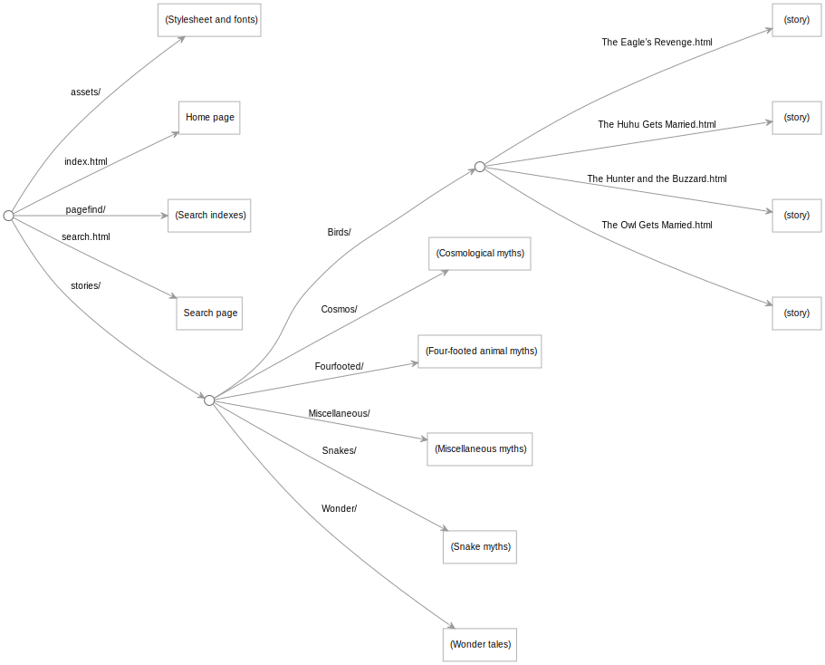

This project showcases the use of [Web Origami](https://weborigami.org) to create a text-focused site with a table of contents and full-text search.

The [site.ori](src/site.ori) Origami file defines the site's structure:

- The `assets` folder contains a stylesheet and fonts.
- The `index.html` page is generated by flattening the structure of the virtual `stories` folder tree into a table of contents.
- The `pagefind` folder contains full-text search indexes generated on demand using [Pagefind](https://pagefind.app).
- The `search.html` page loads the search indexes as needed to let visitors search the stories.
- The `stories` area is based on the `content` folder in the source project, which contains markdown files for each story grouped into chapter folders by topic. This tree of markdown files is mapped into a corresponding tree of HTML files.

The featured stories come from [Myths of the Cherokee](https://www.gutenberg.org/ebooks/45634) by James Mooney, first published in 1900, via [Project Gutenberg](https://www.gutenberg.org). This sample content was selected because it's free, interesting, and deserves to be better known. Like all Native American ethnographies conducted by outsiders long ago, the material is flawed. Nevertheless, reviews of this text on sites such as Amazon and [Goodreads](https://www.goodreads.com/book/show/1316509.Myths_of_the_Cherokee), including reviews from people claiming Cherokee ancestry, are generally positive. If you have reason to believe a myth here should be corrected or removed, please file an issue.

See the official [Cherokee Nation](https://www.cherokee.org/) site for information about the Cherokee people today.
